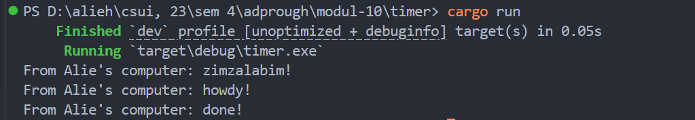

# Tutorial 10: Timer
### 1.2. Understanding how it works.

We can see that the print order is "zimzalabim!", "howdy!", then finally, "done!".
This is because the code to print "howdy!" and "done!" is inside a spawned async task, but the task is not yet executed.
So the code sequence runs `println!("From Alie's computer: zimzalabim!");`, then it runs `drop(spawner);` so the executor knows there are no other tasks, and finally it runs `executor.run();` to execute the task: print "howdy!" and "done!".