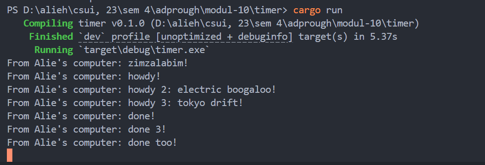

# Tutorial 10: Timer
### 1.2. Understanding how it works.

We can see that the print order is "zimzalabim!", "howdy!", then finally, "done!".
This is because the code to print "howdy!" and "done!" is inside a spawned async task, but the task is not yet executed.
So the code sequence runs `println!("From Alie's computer: zimzalabim!");`, then it runs `drop(spawner);` so the executor knows there are no other tasks, and finally it runs `executor.run();` to execute the task: print "howdy!" and "done!".

### 1.3: Multiple Spawn and removing drop

We can see here that the print tasks don't really execute in their spawned order. This happens because async tasks run concurrently rather than sequentially, so the order of tasks made doesn't really matter.

The process still runs even though all the tasks are completed. This happens because we commented out the `drop(spawner);` line, which makes the executor think there are more tasks to do, so it waits indefinitely.
The `drop(spawner);` line tells the executor that all the tasks had been spawned already and it could shut itself down. 